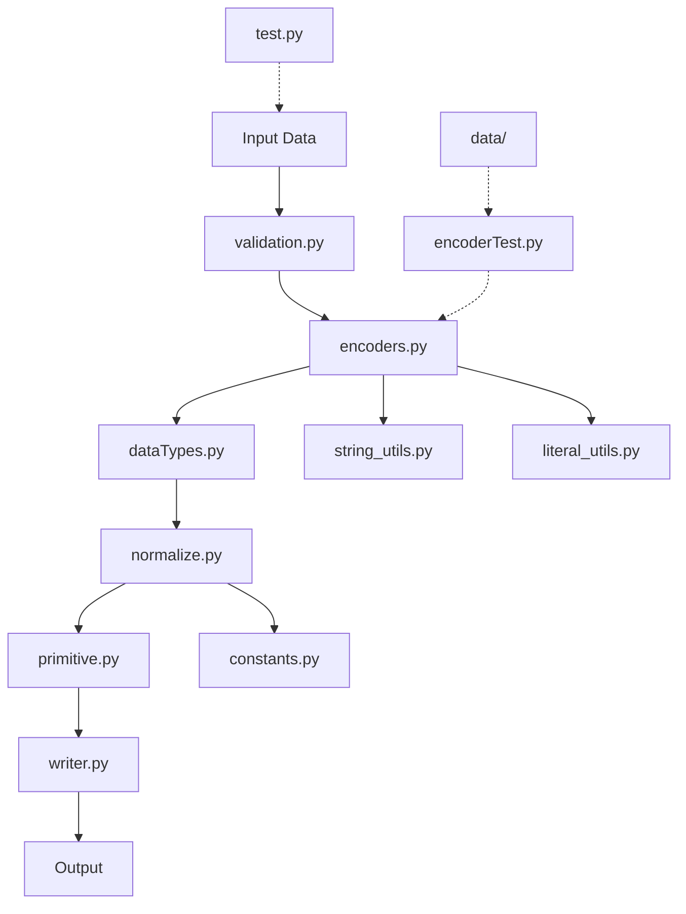

# Elixpo TOON Encoder

A Python-based encoding library for transforming and validating data structures with support for nested objects and custom type handling.

## Overview

This module provides utilities for encoding, validating, and normalizing data according to type specifications and custom rules.

## Core Components

| Module | Purpose |
|--------|---------|
| `encoders.py` | Main encoding logic and transformation rules |
| `dataTypes.py` | Data type definitions and handlers |
| `validation.py` | Input validation and verification |
| `writer.py` | Output serialization |
| `normalize.py` | Data normalization utilities |
| `primitive.py` | Primitive type operations |
| `string_utils.py` | String processing helpers |
| `literal_utils.py` | Literal value utilities |
| `constants.py` | Configuration constants |

## Testing

- `encoderTest.py` - Encoder unit tests
- `test.py` - General test suite
- `data/` - Test fixtures (dummy JSON data with nested structures)

## Usage

```python
from encoders import encode
from validation import validate

# Validate and encode your data
result = encode(data, schema)
```


## Architecture



The architecture flows from input validation through encoding and type handling, with utilities supporting each stage before final serialization to output.
